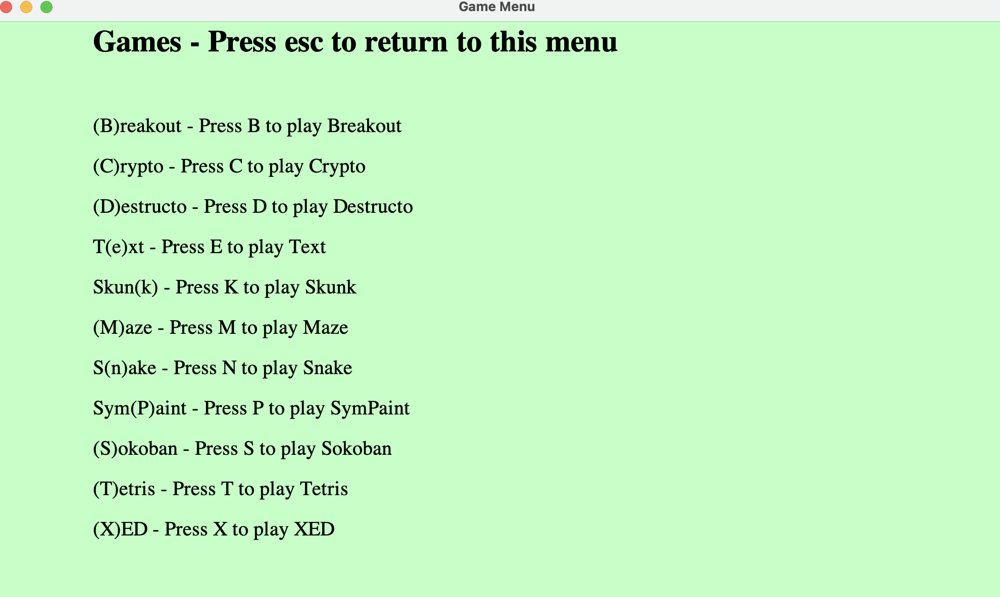
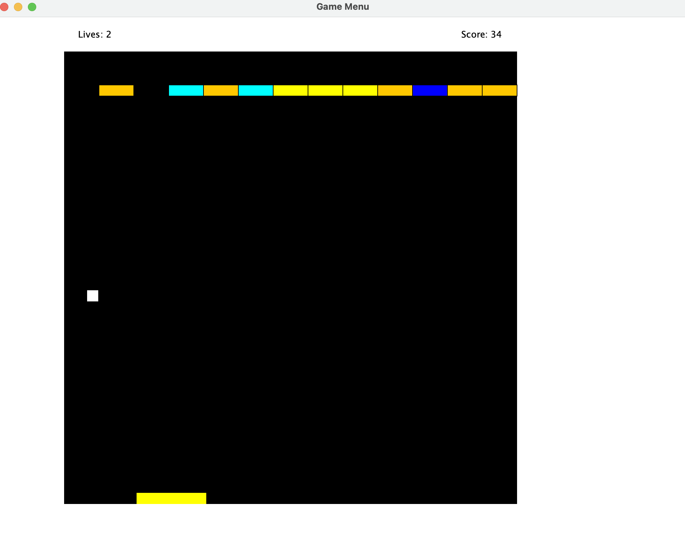
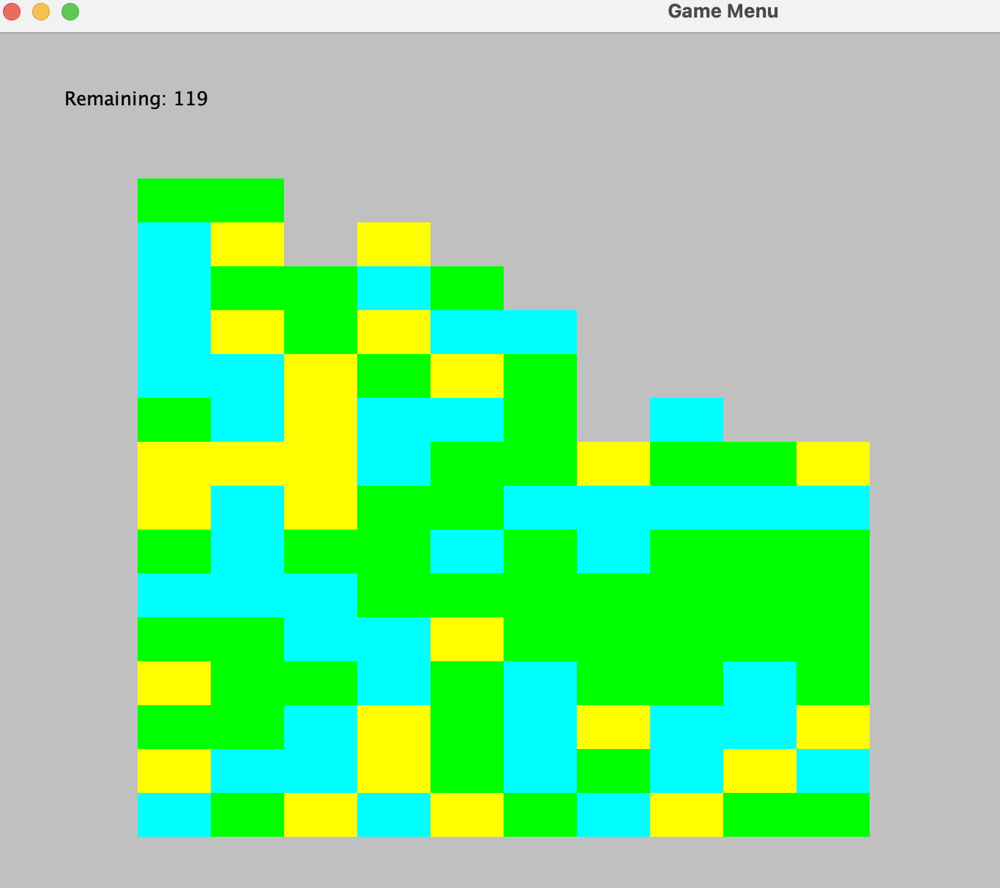

# Games

## Gameverse

Gameverse is taught at Marlin Eller's class.

Run `GameMenu.java`

### Panel:

list of all games in the game universe, press key accordingly to enter one game.

### B: Breakout

Press `space` to release the ball

Press `left` and `right` to move the ball

The goal is to hit as many layers of bricks and do not drop the ball to the ground.

### C: Crypto

Click on one character and type the encrypted character in the red outlined box, and other same characters in the message changes as well.

### D: Destructo

Same color neighbor clusters eliminate each other. If one column is entirely eliminated, the remaining column will shift left.

### E: Text

### K: Skunk

AI trained strategy.

### M: Maze

https://ebookreading.net/view/book/EB9781680501315_87.html

### N: Snake

### S: Sokoban

### T: Tetris

### X: XED

## Othello

Othello is an AI based board game taught by Anthony Mullen.

### Structure

### AI strategy

### Pytest

## Pacman

Othello is an OOD concept animation game taught by Anthony Mullen.
